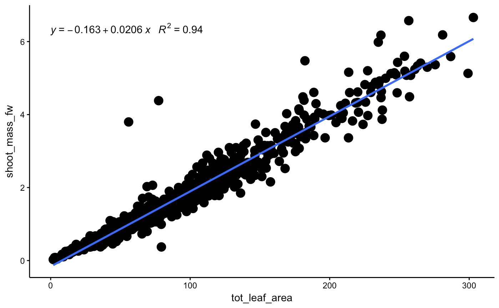
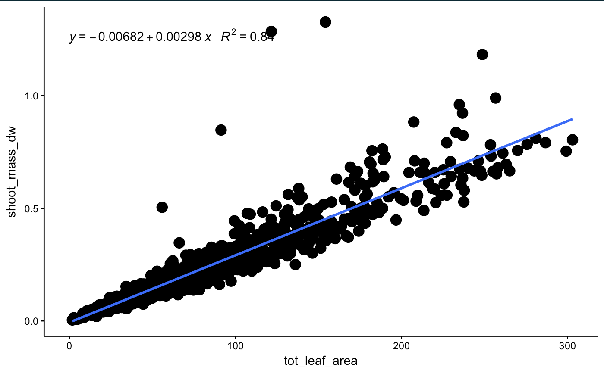

```{r, message = FALSE}
# load file from project folder

biometric_df = read.csv("https://raw.githubusercontent.com/APECS-ak/eelgrass_biometrics_2017/master/eelgrass_biometrics_2017_RAW.csv", stringsAsFactors = FALSE)
```

```{r, message = FALSE, warning = FALSE}
# library packages

library(dplyr); library(tidyr); library(ggplot2); library(ggpmisc)
```

```{r, echo=FALSE}
# select columns of interest from dataframe

biometric_df2 = biometric_df %>% 
  select(site, collection_date, quadrat, plant, leaf_length1, leaf_length2, leaf_length3, leaf_length4, leaf_length5, leaf_length6, leaf_length7, leaf_length8, leaf_length9, leaf_length10, leaf_width1, leaf_width2, leaf_width3, leaf_width4, leaf_width5, leaf_width6, leaf_width7, leaf_width8, leaf_width9, leaf_width10, shoot_mass_fw, shoot_foil, shoot_foil_dw)

unique(biometric_df2)
```

```{r, echo=FALSE}
# calculate the DW of seagrass plant

biometric_df2$shoot_mass_dw = biometric_df2$shoot_foil_dw - biometric_df2$shoot_foil
```

```{r, echo=FALSE}
# calculate the leaf area (cm^2) per blade per plant

biometric_df2$leaf_area1 = biometric_df2$leaf_length1 * biometric_df2$leaf_width1
biometric_df2$leaf_area2 = biometric_df2$leaf_length2 * biometric_df2$leaf_width2
biometric_df2$leaf_area3 = biometric_df2$leaf_length3 * biometric_df2$leaf_width3
biometric_df2$leaf_area4 = biometric_df2$leaf_length4 * biometric_df2$leaf_width4
biometric_df2$leaf_area5 = biometric_df2$leaf_length5 * biometric_df2$leaf_width5
biometric_df2$leaf_area6 = biometric_df2$leaf_length6 * biometric_df2$leaf_width6
biometric_df2$leaf_area7 = biometric_df2$leaf_length7 * biometric_df2$leaf_width7
biometric_df2$leaf_area8 = biometric_df2$leaf_length8 * biometric_df2$leaf_width8
biometric_df2$leaf_area9 = biometric_df2$leaf_length9 * biometric_df2$leaf_width9
biometric_df2$leaf_area10 = biometric_df2$leaf_length10 * biometric_df2$leaf_width10


# calculate total leaf area per plant (there is no biomass data per blade so need to combine all blades)

biometric_df2$tot_leaf_area <- rowSums(biometric_df2[,c("leaf_area1", "leaf_area2", "leaf_area3", "leaf_area4", "leaf_area5", "leaf_area6", "leaf_area7", "leaf_area8", "leaf_area9", "leaf_area10")], na.rm=TRUE)
```

```{r}
# select new columns of interest

biometric_df3 = biometric_df2 %>% 
  select(site, collection_date, quadrat, plant, shoot_mass_fw, shoot_mass_dw, tot_leaf_area)
```


```{r}
# plot regressions of "total leaf area * plant FW" and "total leaf area * plant DW"

theme_set(theme_classic())

my.formula <- y ~ x
plot1 = ggplot(biometric_df3, aes(x=tot_leaf_area, y=shoot_mass_fw))+
  geom_point(size=4)+
  geom_smooth(method=lm, formula=y~x, se=FALSE, fullrange=FALSE)+
  stat_poly_eq(formula = my.formula, 
                aes(label = paste(..eq.label.., ..rr.label.., sep = "~~~")), 
                parse = TRUE)

plot2 = ggplot(biometric_df3, aes(x=tot_leaf_area, y=shoot_mass_dw))+
  geom_point(size=4)+
  geom_smooth(method=lm, formula=y~x, se=FALSE, fullrange=FALSE)+
  stat_poly_eq(formula = my.formula, 
                aes(label = paste(..eq.label.., ..rr.label.., sep = "~~~")), 
                parse = TRUE)

plot(plot1)
plot(plot2)
```





# That's all for now!


